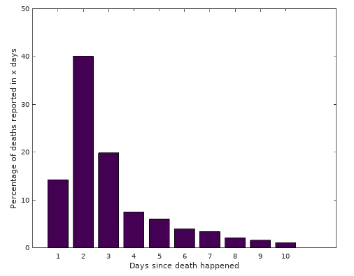

# cv19api | Covid 19 API & Data Scraper

## What

This is an API providing Covid19 death statistics across hospitals in England. We automatically scrape the latest figures
from NHS England every day to give you the most accurate picture possible of *actual* daily deaths, not just reported
daily deaths.

## Why
### De-biasing NHS England death reports

A problem with death reporting right now is that the daily figures that get publicised in the media *do not* represent
the number of deaths that occurred that day. In fact, many deaths can take as much as 10 days to filter through into
these reports. Interpreting the reported death figures can give a false impression about the crisis we face.

The point is illustrated below. Using the 11th April data from NHS England, this is a graph of the number of days since the
reported death actually occurred.



You can see that about 40% of cases take 2 days to report, but there is a long tail on the distribution. Assuming that 
this is the distribution, in order to get a ~95% accurate picture of daily deaths, we have to take at least the 7 days 
of data that come after this date.

## Basic Documentation

API Base URL: `https://api.cv19api.com/api/v1`

__Endpoints__

- `/deaths` - accumulated death numbers grouped by day
- `/deaths/regions` - grouped by NHS Region
- `/deaths/trusts` - grouped by NHS Trust 

__String Query Parameters__

All dates are in _ISO8601_ Format: `YYYY-MM-DD`

- `to` - Start ground truth date
- `from` - End ground truth date 
- `recordedOnTo` - Start reported date
- `recordedOnFrom` - End reported date

#### Examples

Counts of deaths from `2020-03-17` to `2020-04-13`

`https://api.cv19api.com/api/v1/deaths/?from=2020-03-17&to=2020-04-13`

Will yield:

```
{'data': [{'date': '2020-04-12', 'deaths': 118},
  {'date': '2020-04-11', 'deaths': 443},
  {'date': '2020-04-10', 'deaths': 516},
  {'date': '2020-04-09', 'deaths': 611},
  ...
 'metaData': {'from': '2020-03-18',
  'recordedOnFrom': '2020-03-17',
  'recordedOnTo': '2020-04-13',
  'to': '2020-04-17'}}
  ```

---

`https://api.cv19api.com/api/v1/deaths/?recordedOnFrom=2020-03-17&recordedOnTo=2020-04-13`

Will yield:

```
{'data': [{'date': '2020-04-13', 'deaths': 566},
  {'date': '2020-04-12', 'deaths': 610},
  {'date': '2020-04-11', 'deaths': 671},
  {'date': '2020-04-10', 'deaths': 641},
  ...
 'metaData': {'from': '2020-03-17',
  'recordedOnFrom': '2020-01-01',
  'recordedOnTo': '2020-04-17',
  'to': '2020-04-13'}}
  ```

---

`https://api.cv19api.com/api/v1/deaths/trusts/?from=2020-03-17&to=2020-04-13`


Will yield:

```
{'data': [{'date': '2020-04-13',
   'deaths': 1,
   'trust': 'AIREDALE NHS FOUNDATION TRUST'},
  {'date': '2020-04-13',
   'deaths': 2,
   'trust': 'ANGLIAN COMMUNITY ENTERPRISE CIC - CLACTON HOSPITAL'},
  {'date': '2020-04-13',
   'deaths': 3,
   'trust': "ASHFORD AND ST PETER'S HOSPITALS NHS FOUNDATION TRUST"},
  ...],
 'metaData': {'from': '2020-03-17',
  'recordedOnFrom': '2020-01-01',
  'recordedOnTo': '2020-04-17',
  'to': '2020-04-13'}}
  ```

---

`https://api.cv19api.com/api/v1/deaths/regions/?from=2020-03-17&to=2020-04-13`


Will yield:

  ```
{'data': [{'date': '2020-04-13', 'deaths': 199, 'region': 'EAST_OF_ENGLAND'},
  {'date': '2020-04-13', 'deaths': 98, 'region': 'MIDLANDS'},
  {'date': '2020-04-13', 'deaths': 81, 'region': 'NORTH_EAST_AND_YORKSHIRE'},
  {'date': '2020-04-13', 'deaths': 102, 'region': 'NORTH_WEST'},
  {'date': '2020-04-13', 'deaths': 62, 'region': 'SOUTH_EAST'},
  {'date': '2020-04-13', 'deaths': 24, 'region': 'SOUTH_WEST'},
  {'date': '2020-04-12', 'deaths': 221, 'region': 'EAST_OF_ENGLAND'},
  ...],
 'metaData': {'from': '2020-03-17',
  'recordedOnFrom': '2020-01-01',
  'recordedOnTo': '2020-04-17',
  'to': '2020-04-13'}}
  ```